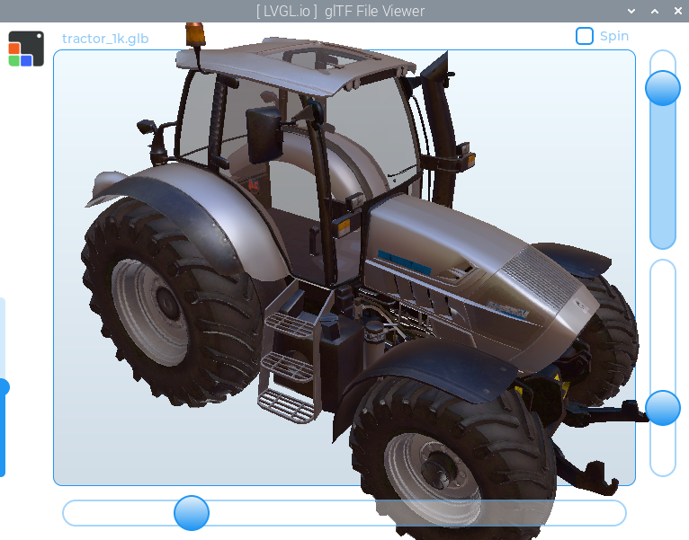
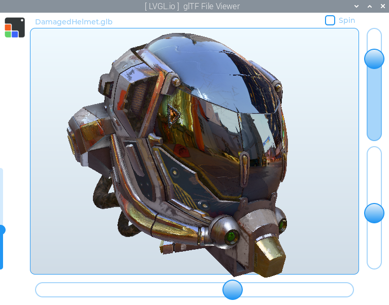

# `lv_gltf_viewer`

A simple glTF file viewer, made using the LVGL `3dtexture` widget.


Ensure [GLFW is installed](https://docs.lvgl.io/master/details/integration/driver/opengles.html) for this example.

prebuild.sh will initialize git submodules, then build and install fastgltf

```shell
./prebuild.sh
cmake -B build -S .
make -C build -j$(nproc) lvgl_workspace
./build/lvgl_workspace
```

For demonstration purposes, there is a very simple
glTF loader.  This is a proof of concept build and there
are many known issues.

---


There is some issue with the latest LVGL that break things in this app, so for now you'll need to not use the main LVGL branch and instead delete the LVGL folder and extract the older version with the bash commands below:

```bash
rm ./LVGL -rf
tar -xvzf lvgl_known_good.tar.gz -C ./
```
This will extract the known good copy into the LVGL folder (it will create a new LVGL folder).

This app requires a non-standard function within lvgl/src/drivers/glfw/lv_glfw_window.c / .h, but if you did the steps above, don't worry about it, it's in there.  Otherwise, you may need to add this function (and it's declaration) to lv_glfw_window.c/h:

```c
void * lv_glfw_window_get_glfw_window(lv_glfw_window_t * window) {
    return (void*)(window->window);
}
```

I'll put in a PR to get that added in properly but if you encounter compilation errors you 
might need to patch that function in manually for now.

The STB Image library is included temporarily, just copied from the latest build.  Ultimately it should probably be added as a git submodule, but it seems like that will add a few other things that aren't necessary so I'd like to look into a more minimal install for that.

---





