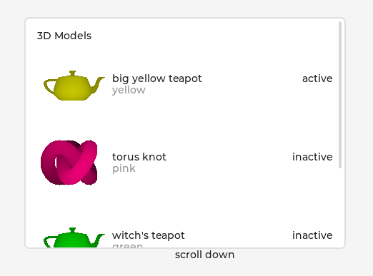

# `lv_gltf_viewer`

A simple glTF file viewer, made using the LVGL `3dtexture` widget.



Ensure [GLFW is installed](https://docs.lvgl.io/master/details/integration/driver/opengles.html) for this example.

prebuild.sh will initialize git submodules, then build and install fastgltf

```shell
./prebuild.sh
cmake -B build -S .
make -C build -j$(nproc) lvgl_workspace
./build/lvgl_workspace
```

For demonstration purposes, there is a very simple
glTF loader.  This is a proof of concept build and there
are many known issues.
