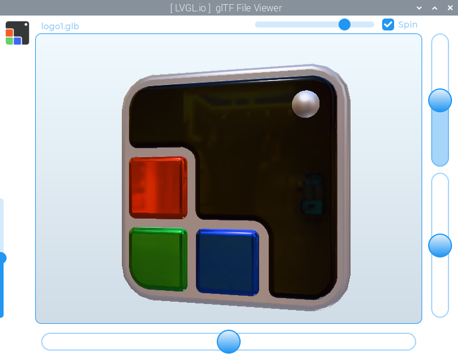
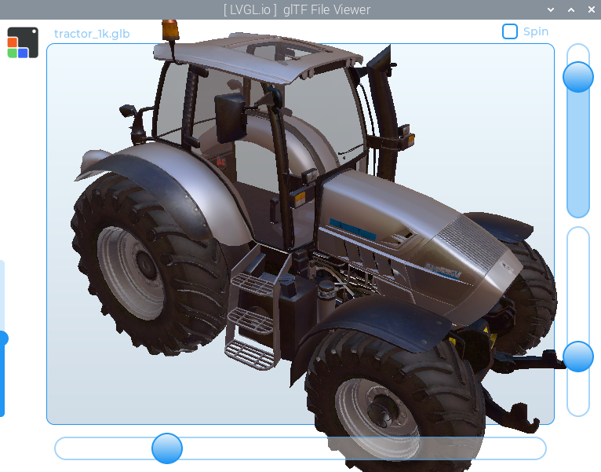

# `lv_gltf_viewer`

A simple glTF file viewer, made using the LVGL `3dtexture` widget.



Ensure [GLFW is installed](https://docs.lvgl.io/master/details/integration/driver/opengles.html) for this example.

prebuild.sh will initialize git submodules, then build and install fastgltf

```shell
./prebuild.sh
cmake -B build -S .
make -C build -j$(nproc) lvgl_workspace
./build/lvgl_workspace
```

For demonstration purposes, there is a very simple
glTF loader.  This is a proof of concept build and there
are many known issues.

to build:
```bash
./prebuild.sh
./full_build.sh
```

Run from within it's root directory, so it can find the HDR folder and load an environment.

---

The STB Image library is included temporarily, just copied from the latest build.  Ultimately it should probably be added as a git submodule, but it seems like that will add a few other things that aren't necessary so I'd like to look into a more minimal install for that.

---

To make this the default gltf / glb file viewer on your Raspberry Pi, you can do the following:

(from the root directory of this project)
```bash
cp ./EXAMPLE_gltf-view.desktop ~/.local/share/applications/gltf-view.desktop
xdg-mime default gltf-view.desktop model/gltf-binary
xdg-mime default gltf-view.desktop model/gltf-json
```

Now when you double click a gltf file in your file-manager, it should open glTF-View.

You can confirm the mime-types are setup correctly by viewing 
```
~/.config/mimeapps.list
```

---
More Samples:




